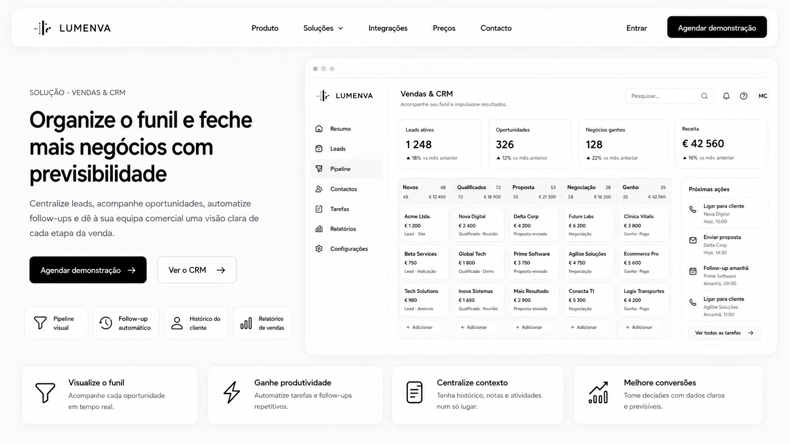
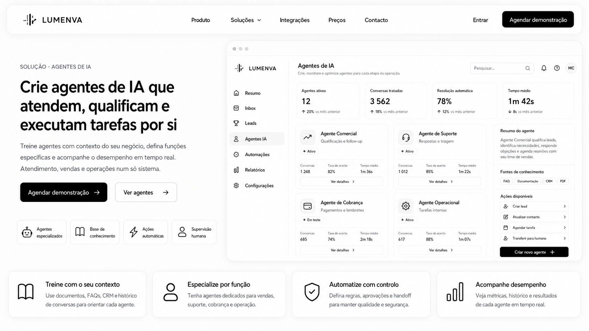
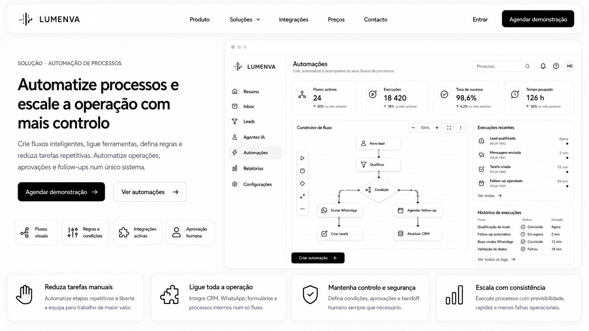

<div align="center">

# Lumenva

**Sistema operativo de vendas com IA, open source e self-hosted — para WhatsApp.**

Agentes de IA que atendem, qualificam e movem o funil dentro de um CRM que corre no teu servidor.
Sem mensalidade, sem funcionalidade bloqueada, os teus dados contigo. Conforme o RGPD por desenho.

[](https://nextjs.org)
[](https://www.typescriptlang.org)
[](https://supabase.com)
[](hostgator-setup-kit/)
[](LICENSE)

[**Visão**](VISION.md) · [**Setup**](docs/SETUP.md) · [**Arquitetura**](ARCHITECTURE.md) · [**Contribuir**](CONTRIBUTING.md) · [**Roadmap**](#roadmap)

</div>

<p align="center">
  
</p>

---

## O que é

**Lumenva** põe toda a operação comercial numa mesa só, operada por pessoas e agentes de IA em conjunto.

O core é um CRM multi-tenant: funil configurável por nicho, inbox de WhatsApp em tempo real, contactos, tarefas e relatórios. Por cima, agentes de IA com RAG por organização atendem, qualificam, disparam automações e sabem quando passar a conversa a um humano — com o CRM inteiro exposto via **MCP** para os agentes operarem a sério.

- **Agentes que operam o CRM** — RAG por tenant, análise de sentimento, handoff IA→humano auditado, IA como responsável de conversa de primeira classe, controlo de budget por organização.
- **Multi-nicho por desenho** — vocabulário configurável por pipeline: *lead* torna-se *Cliente*, *Paciente* ou *Comprador*; *ganho* torna-se *Pago*, *Agendado* ou *Fechado*.
- **WhatsApp nativo via WAHA** — multi-número, anti-banimento (throttle + jitter + janela horária), média via Storage, deteção de STOP.
- **Governança de atendimento** — RBAC server-side real, atribuição e transferência auditadas, fila com posição, encaminhamento automático, âmbito de visibilidade por papel.
- **Multi-tenant + RGPD por desenho** — RLS em toda a tabela tenant-aware com teste de isolamento; anonimização preferida ao apagamento; registo de auditoria append-only.
- **Self-hosted a sério** — os teus dados na tua VPS, instalação com um comando, sem versão paga.

---

## Ecrãs

| Vendas & CRM | Agentes de IA | Automações |
|---|---|---|
|  |  |  |
| Funil visual, oportunidades, próximas ações e receita num só ecrã. | Cria, monitoriza e especializa agentes por função, com base de conhecimento e supervisão humana. | Construtor de fluxos QUANDO/SE/ENTÃO, execuções e histórico. |

---

## Quickstart (desenvolvimento)

```bash
# 1. Clonar
git clone https://github.com/trydavidqix/Lumenva.git
cd Lumenva

# 2. Node 22 + pnpm
nvm use
npm install -g pnpm
pnpm install

# 3. Variáveis de ambiente
cp .env.example .env.local
# Editar .env.local — guia completo em docs/SETUP.md

# 4. WAHA local (opcional em dev sem WhatsApp)
docker compose up -d

# 5. Schema — aplicar o baseline, NÃO as migrations
#    As migrations 0001-0009/0013 são stubs; a cadeia não sobe do zero.
#    O schema real vive em supabase/baseline.sql (o mesmo que o install.sh aplica).
supabase link --project-ref <o-teu-ref>
psql "$SUPABASE_DB_URL" -v ON_ERROR_STOP=1 -f supabase/baseline.sql

# 6. Subir a app
pnpm dev
```

App: <http://localhost:3000> · Health check: <http://localhost:3000/api/v1/health>

> Primeira vez? [`docs/SETUP.md`](docs/SETUP.md) é o passo a passo completo de todas as integrações (Supabase, WAHA, OpenAI, Anthropic como fallback, Upstash, Sentry, Resend, Nuvemshop).

### Produção (self-host, um comando)

```bash
git clone https://github.com/trydavidqix/Lumenva.git
cd Lumenva
bash hostgator-setup-kit/install.sh
```

O instalador pergunta só o que é teu (domínio, chaves do Supabase, chave de IA, senha do admin), valida cada resposta, gera os restantes segredos, aplica o schema e sobe a stack com HTTPS. Detalhes em [`hostgator-setup-kit/README.md`](hostgator-setup-kit/README.md).

---

## Stack

| Camada | Escolha |
|---|---|
| **Frontend** | Next.js 16 App Router (Turbopack) + React 19 + TypeScript estrito |
| **Estilo** | Tailwind + shadcn/ui (`new-york`, neutral) |
| **DB** | Supabase (Postgres + RLS + `vector`) |
| **Auth** | Supabase Auth via `@supabase/ssr` (cookie SameSite=Strict, HttpOnly) |
| **Realtime** | Supabase Realtime (postgres_changes + broadcast) |
| **Storage** | Supabase Storage (URLs assinadas, bucket privado) |
| **WhatsApp** | WAHA Plus (engine NOWEB) |
| **Filas** | tabela `event_log` + workers (cron) |
| **Rate limit** | Upstash Redis (sliding window) |
| **AI** | Vercel AI SDK com provider direto em produção (agentes OpenAI `gpt-5.6-terra`, credencial BYOK; Anthropic como fallback) |
| **Validação** | Zod (input externo, env, payloads) |
| **Observability** | Sentry (scrub em erro, transação, span, breadcrumb) — opt-in |

Detalhes em [`ARCHITECTURE.md`](ARCHITECTURE.md).

---

## Testes

```bash
pnpm typecheck     # tsc --noEmit (estrito)
pnpm lint          # eslint next/core-web-vitals
pnpm test:unit     # Vitest
pnpm test:db       # Postgres efémero + baseline install/update + invariantes
pnpm test:e2e      # Playwright (requer dev server)
```

O GitHub Actions está desativado; a verificação é local. `tests/invariants/` cobre RBAC, atribuição, âmbito de visibilidade, encaminhamento, follow-up, webhooks e automações — incluindo o **teste de isolamento RLS**: duas organizações, claims JWT pelo mesmo caminho `auth.uid()` / `fn_user_org_ids()` das policies de produção, e a prova de que a org A vê **zero linhas** da org B em `conversations`, `messages`, `contacts` e `crm_leads`.

---

## Documentação

| Doc | O que tem |
|---|---|
| [`VISION.md`](VISION.md) | Visão e posicionamento |
| [`docs/SETUP.md`](docs/SETUP.md) | Setup completo passo a passo |
| [`docs/white-label.md`](docs/white-label.md) | Instalar para clientes — trocar a marca, revenda |
| [`CLAUDE.md`](CLAUDE.md) | Convenções não-negociáveis (leitura obrigatória para contribuir) |
| [`ARCHITECTURE.md`](ARCHITECTURE.md) | Arquitetura numa página |
| [`docs/runbooks/`](docs/runbooks/) | Runbooks de produção (deploy, WAHA, feature flags, memória) |
| [`docs/DEPLOY-CHECKLIST.md`](docs/DEPLOY-CHECKLIST.md) | Preflight pré-go-live |

---

## Contribuir

1. Ler [`CLAUDE.md`](CLAUDE.md) — convenções não-negociáveis (multi-tenancy, RLS, auditoria, RGPD).
2. Ler [`CONTRIBUTING.md`](CONTRIBUTING.md) — fluxo de branches, commits.
3. Seguir o [Código de Conduta](CODE_OF_CONDUCT.md).

```bash
git checkout -b feat/short-slug
# implementar + testes
pnpm typecheck && pnpm lint && pnpm lint:channels && pnpm test:unit && pnpm test:shell && pnpm build
pnpm test:db
git commit -m "feat(escopo): descrição"
```

**Definition of Done:** typecheck zero, lint zero, testes relevantes verdes, RLS testada se toca tabela tenant-aware, registo de auditoria emitido em mutações, migration versionada se muda schema.

---

## Roadmap

**Entregue** — fundação & plataforma (auth com MFA para admin, multi-tenancy com RLS + teste de isolamento, RBAC 4 papéis, auditoria append-only), atendimento WhatsApp (inbox 3 painéis em tempo real, WAHA multi-número, anti-banimento), CRM & pedidos (kanban com vocabulário por nicho, customer 360, integração Nuvemshop), IA nativa (agentes com RAG por tenant, análise de sentimento, handoff, MCP server interno), RGPD (export e apagamento via workers, anonimização em cascata, consentimento auditado), self-host (`hostgator-setup-kit`, `baseline.sql` auto-curativo), webhooks & automação, governança de atendimento, arquivar conversa por utilizador.

**Próximo** — MCP público, flywheel de auto-aprimoramento (conversa resolvida → conhecimento → agente melhor), templates por nicho (clínica, imobiliária, infoproduto, serviços), integrações VTEX e Shopify via adapter pattern, identity probabilística entre canais.

---

## Licença

Distribuído sob a licença **MIT** — ver [`LICENSE`](LICENSE). Podes usar, modificar e distribuir livremente, inclusive comercialmente. O software é fornecido **"como está", sem garantias**.

## Suporte & responsabilidades (self-host)

Cada pessoa corre o Lumenva na **própria infraestrutura** (VPS, Supabase e chave de IA próprios). O suporte é comunitário e "as-is" via Issues/Discussions — sem SLA. Quem **aloja** a instância é o **responsável pelo tratamento** dos dados pessoais ali tratados (clientes, conversas, pedidos), com as obrigações do RGPD. Os mantenedores do projeto não são responsáveis pelo tratamento nem subcontratantes da tua instância e não têm acesso ao teu banco, WhatsApp ou storage.

<div align="center">

**Open source · Made for the community**

</div>

## Arquitetura

```text
Cliente / operador
        │
        ▼
CRM — Control Plane (decide)
        │  API · MCP · CLI · workers · agentes · browser
        ▼
authorize_module(organization_id, module, action, ...)
        │
        ├── ALLOW / DENY
        └── Stripe webhook assinado → estado de pagamento
        │
        ├── Agent Birth Pipeline → agentes com identidade e políticas versionadas
        ├── Job Engine / workers / agentes Codex (Claude é o único orquestrador)
        └── BrowserMesh — Execution Plane (executa; repo próprio)
                         │
                         └── trydavidqix/BrowserMesh

Postgres — fonte única da verdade
organization_id — tenant canónico; RLS em toda fronteira tenant-aware
```

### Regras constitucionais

- O **CRM é o Control Plane**: decide estado, políticas, aprovações, módulos e ações.
- O **BrowserMesh é o Execution Plane**: executa processos; o projeto real é `trydavidqix/BrowserMesh`. A integração estende esse repositório e nunca reescreve o BrowserMesh do zero.
- O **Postgres é a fonte única da verdade** para o estado persistente. Contexto de frontend, browser, CLI ou modelo não é autoridade.
- `organization_id` é o tenant canónico. Toda API, MCP, CLI, worker, agente e browser boundary tenant-aware aplica RLS e nunca confia no `organization_id` vindo do body como autoridade.
- Todo agente nasce pelo mesmo **Agent Birth Pipeline**, com definição, contratos, políticas, ferramentas, skills, memória, verificação, guardrails, evals e versão publicada.
- **Claude é o único orquestrador de agentes Codex**. O CRM decide e regista; BrowserMesh executa; os agentes não se auto-orquestram fora das políticas.

### Camada comercial: planos e entitlements

Os planos comerciais são **Básico**, **Médio** e **Premium**. O acesso é definido por módulos e entitlements, nunca por verificações de plano espalhadas pelo código.

Modelo persistente:

- `plans` — catálogo dos três planos.
- `modules` — capacidades comerciais nomeadas.
- `plan_modules` — módulos incluídos por plano.
- `organization_plan` — plano vigente por organização.
- `entitlement_events` — histórico append-only de concessões, alterações, suspensões e revogações.

Todo boundary chama o mesmo gate central:

```text
authorize_module(organization_id, module, action, ...)
        ├── ALLOW
        └── DENY
```

O gate é obrigatório em API, MCP, CLI, worker, agente e browser. Não usar `if-plan` espalhado em handlers, componentes, workers ou prompts. A decisão deve ser server-side, tenant-aware, auditável e consistente em todas as superfícies.

O **Stripe é a fonte da verdade do estado de pagamento**. A aplicação aceita apenas webhooks Stripe assinados, verifica a assinatura e atualiza `organization_plan`/`entitlement_events`. O frontend nunca decide que uma compra foi paga nem concede módulos por conta própria.

### Ordem de execução atual

1. Implementar entitlements e o gate `authorize_module` em todos os boundaries.
2. Corrigir produção e migrations necessárias, preservando baseline, RLS e evidência de schema.
3. Integrar Stripe por webhook assinado; frontend sem autoridade de pagamento.
4. Entregar o primeiro cliente ponta a ponta, da contratação ao uso real dos módulos.
5. Executar os testes relevantes de módulo, tenant, pagamento, webhook, idempotência e regressão.
6. Só depois retomar o restante do roadmap de 16 waves do Business OS. Agentes de vendas, suporte, marketing, memória e autonomia continuam secundários a esta camada comercial.

### Limite de prioridade

Cada nova feature deve declarar o módulo e a ação que autoriza. Se não aproxima o primeiro cliente ou não torna o entitlement verificável, permanece fora da prioridade atual. A camada comercial não altera as regras constitucionais de Control Plane, Execution Plane, Postgres, RLS ou Agent Birth Pipeline.
