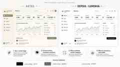

# Lumenva CRM — Referência visual aprovada

Esta pasta contém a referência visual aprovada para a implementação do CRM na branch `gpt-lumenva-crm-ui`.

## Paleta oficial

| Token | HEX | Uso principal |
|---|---|---|
| Lumenva Black | `#111111` | texto principal, CTAs, fundos escuros, foco |
| Lumenva Gray | `#6E6E73` | texto secundário, ícones e apoio |
| Lumenva White | `#F5F5F7` | fundo principal claro e grandes superfícies |

## Derivações técnicas permitidas

A marca continua limitada a preto, cinzento e branco. O produto pode usar derivados neutros para hierarquia e acessibilidade, incluindo `#FFFFFF`, `#FAFAFA`, `#E8E8ED`, `#D2D2D7`, `#AEAEB2`, `#8E8E93`, `#48484A`, `#3A3A3C`, `#2C2C2E` e `#1C1C1E`.

## Direcção visual

- Apple-inspired SaaS premium, luxury, profissional e confortável, sem copiar a Apple.
- Light mode é a referência principal; cerca de 70–80% das grandes áreas devem ser claras.
- Dark mode permanece como alternativa premium.
- Muito espaço negativo, hierarquia clara, sombras discretas e poucas bordas.
- Nada de verde Sage, cores cromáticas, neon, cyberpunk ou estética de IA genérica.
- Estados devem ser compreensíveis por ícone, texto, forma e contraste; cor nunca é o único canal.
- A referência visual orienta a pele do produto; fluxos e comportamento de negócio não devem ser alterados apenas por esta migração.

## Escopo desta branch

Somente CRM/produto: design system, dashboard, sidebar, Inbox, Pipeline, Contactos, Agentes IA, Automações, relatórios, definições e componentes partilhados. Não alterar o website nesta branch.
