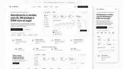
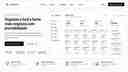

# Lumenva Website — Referências visuais aprovadas

Esta pasta contém as referências visuais aprovadas para a implementação do website na branch `gpt-lumenva-site-ui`.

## Referências

### Homepage / composição geral

### Hero principal

### Solução — Atendimento com IA

### Solução — Vendas & CRM

### Solução — Agentes de IA

### Solução — Automação de Processos

## Paleta oficial

| Token | HEX | Uso principal |
|---|---|---|
| Lumenva Black | `#111111` | títulos, texto principal, CTAs e contraste |
| Lumenva Gray | `#6E6E73` | texto secundário, ícones e apoio |
| Lumenva White | `#F5F5F7` | fundo principal e grandes superfícies |

## Derivações neutras permitidas

A marca permanece exclusivamente preta, cinzenta e branca. Para superfície, borda, hover e profundidade podem ser usados derivados neutros: `#FFFFFF`, `#FAFAFA`, `#E8E8ED`, `#D2D2D7`, `#AEAEB2`, `#8E8E93`, `#48484A`, `#3A3A3C`, `#2C2C2E` e `#1C1C1E`.

## Direcção visual

- Apple-inspired SaaS premium, luxury, profissional e confortável, sem copiar a Apple.
- Predominância clara, com muito espaço negativo e baixa carga visual.
- Botões principais pretos; componentes secundários brancos/cinzentos.
- Sombras suaves, bordas discretas, radius consistente e tipografia muito legível.
- Nada de verde Sage, cores cromáticas, neon, cyberpunk ou estética de IA genérica.
- O website e o CRM devem parecer partes do mesmo sistema visual Lumenva.

## Arquitectura aprovada do menu Soluções

1. Atendimento com IA
2. Vendas & CRM
3. Agentes de IA
4. Automação de Processos

## Escopo desta branch

Somente website/marketing: navegação, homepage, hero, páginas de solução, integrações, preços, contacto, responsividade e componentes partilhados do site. Não alterar o CRM nesta branch.

> As imagens são referências visuais de implementação. A interface final deve respeitar conteúdo, responsividade, acessibilidade e componentes reais do projecto; não deve tentar reproduzir artefactos de geração de imagem ao nível de pixel.
