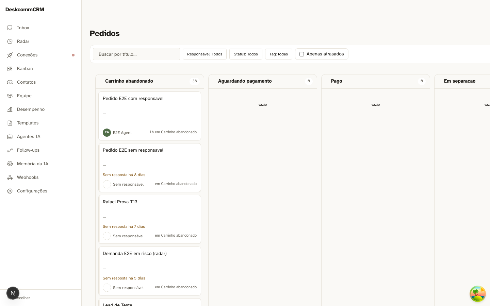
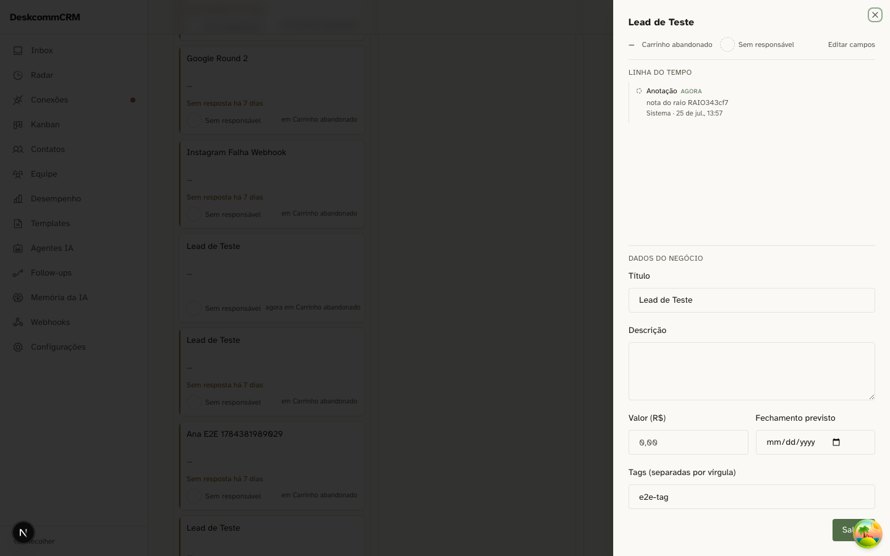
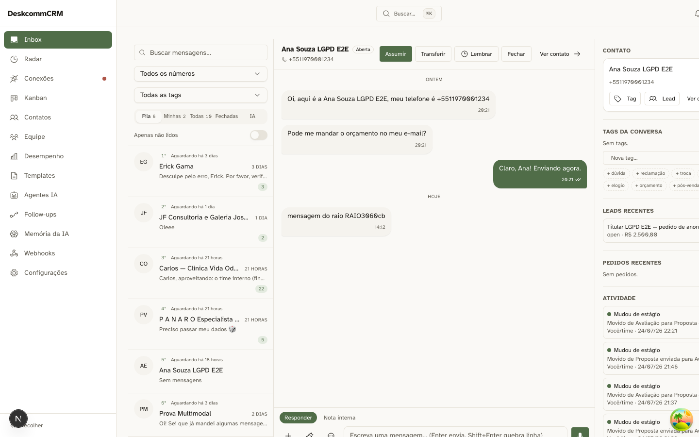

# Raio-X do silêncio — o que o usuário vê quando o tempo real morre

> Medido em 25/07, commits `c3b6259` (raio) e `f8bcec4` (relógio).
> Sonda: `tests/prova-raio-do-silencio.ts`.

## A pergunta

Hoje ficou provado que a entrega de `postgres_changes` pode morrer enquanto o
canal continua se declarando `SUBSCRIBED`. Isso torna urgente uma pergunta que é
de **produto** e sobrevive a qualquer conserto daquela raiz: com a entrega morta,
a tela avisa? Ela se recupera sozinha? Ou fica mostrando dado velho com cara de
saudável?

O estado que falta é o **terceiro**. Não é "ao vivo" contra "morto": é ao vivo,
morto e **não sei**. Uma tela que só sabe dizer "conectado" transforma o não sei
em saudável — e é o pior dos três, porque some sem deixar rastro.

## Como a entrega foi morta sem derrubar o canal

Um proxy de WebSocket engole **apenas** os quadros de dados e deixa passar join,
`phx_reply` e heartbeat. O canal continua confirmando e o app continua achando
que está vivo. Fechar o socket seria outro defeito — visível — e mediria a tela
errada.

Tudo rodou no pipeline **saudável**: medir no funil quebrado empilharia as duas
mortes e a rodada de controle não teria como passar.

## O par, em cada superfície

Cada superfície roda duas vezes com o mesmo proxy no caminho: uma repassando
tudo (controle positivo), outra engolindo os dados. Sem a rodada transparente,
"nada apareceu" não distinguiria "a entrega morreu" de "o proxy quebrou a
página" nem de "o gatilho não produziu nada".

### Board

| controle vivo | entrega morta |
|---|---|
|  |  |

Controle: muda em ~2-4s. Morta: **3/3 nunca em 30s**, e não volta nem ao
retornar para a aba.

### Dossiê

| controle vivo | entrega morta |
|---|---|
|  |  |

Controle: muda em ~2s. Morta: **3/3 nunca em 30s**, idem no retorno à aba.

### Inbox

| controle vivo | entrega morta |
|---|---|
|  |  |

Controle: muda em ~2s. Morta: **quatro rodadas idênticas deram três resultados
diferentes** — 2/4 nunca, 1/4 só ao voltar para a aba, 1/4 sozinha em ~4s.

## O que as imagens mostram

> Escrevi aqui, antes de olhar, que "não há diferença visível entre as colunas".
> Era falso — e o que as capturas mostram é pior do que eu tinha suposto.

**O dossiê não fica em branco: ele afirma.** Com a entrega viva, a linha do tempo
traz a nota nova ("Anotação · agora"). Com a entrega morta, o mesmo painel diz
**"Nada aconteceu com este negócio ainda."** Aconteceu. A tela não está omitindo
uma informação que não tem — está declarando uma que está errada, e com a
confiança de um estado vazio legítimo.

**O board parece intacto.** A captura com a entrega morta é um funil normal,
colunas contadas, cards no lugar. Nada distingue aquela tela de uma saudável.

**O inbox se contradiz sozinho.** A captura veio da rodada em que a conversa se
recuperou: a mensagem nova aparece na thread, e a MESMA tela, na lista à
esquerda, continua dizendo "Sem mensagens" para aquela conversa. Os dois painéis
discordam entre si, na mesma foto.

- **Aviso ao usuário: nenhum**, em nenhuma superfície e em nenhuma rodada. O
  critério foi "a tela diz *alguma* coisa" — vocabulário largo de propósito
  (offline, sem conexão, desatualizado, reconectando, pausado) — e não "a tela
  diz do meu jeito".
- **O estado exposto mente.** Board e dossiê publicam `data-realtime-status` e
  ele diz `subscribed` com a entrega morta, porque descreve a **assinatura**, não
  a **entrega**.
- **Não há refetch de segurança** em board e dossiê: nem por tempo, nem ao voltar
  para a aba.

## A consequência que muda o encaminhamento

A dívida antiga dizia "7 de 9 consumidores ignoram o status", e o conserto
implícito era fazê-los ler. Medindo: são **10 usos**, 8 descartam o status e os 2
que capturam depositam num atributo que existe para teste — **zero mostram
qualquer coisa a um humano**.

Mas exibir o valor disponível seria **pior**: trocaria ausência de informação por
afirmação confiante e errada. O conserto real é **produzir o sinal que falta**
(houve entrega recente?), não distribuir melhor o que já existe.

## E o caso real

Isto não é hipótese de laboratório. O funil "CRM Vivo — Clínica" ficou mudo por
pelo menos 2h32 no mesmo dia, com **9 atividades e 6 mudanças de negócio**
escritas nesse intervalo, nenhuma entregue ao vivo — e, pelas medições acima,
nenhum usuário teria como saber.
