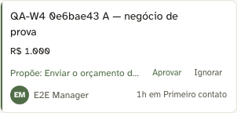
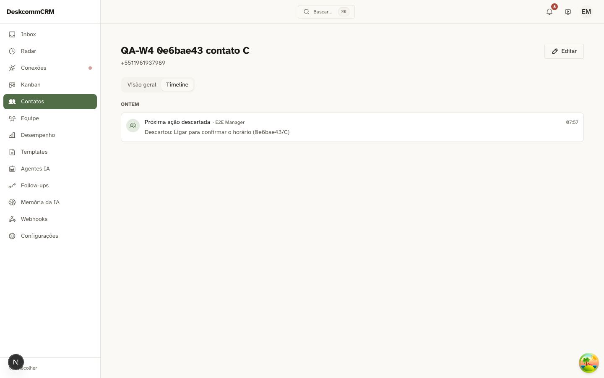
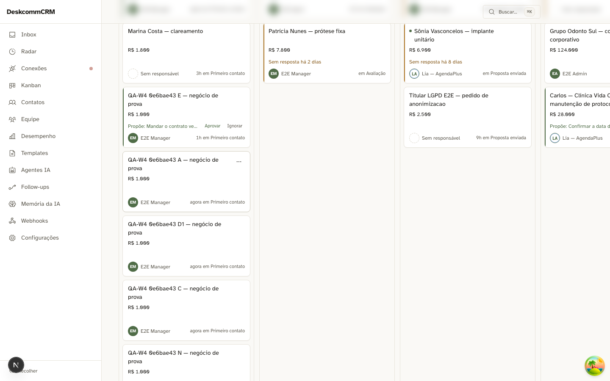
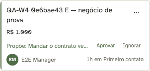
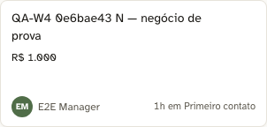

# Wave 4 — CORE 4 · a próxima ação sobe para o card · 2026-07-25

**Placar final: 17 verdes · 0 vermelhos · 0 bloqueados.**

| | |
|---|---|
| Carimbo | `HEAD=feaf5be`, oito dependências declaradas, **todas limpas** |
| Aparato | `tests/capture-wave-4-cenarios.ts` |
| Apoio | `tests/ataque-sonda-ambiguo.ts` (ataque à sonda do caso ambíguo) |

## O aparato foi escrito ANTES do código

Não por cerimônia. Um aparato escrito depois tende a descrever **o que o código
faz**; escrito antes, descreve **o que o contrato exige**. A diferença apareceu
exatamente nos dois critérios que ninguém lembraria de pedir depois: a recusa
como sinal (13.c) e a autorização vencida (13.e).

## Os critérios

| # | Verificação | Prova |
|---|---|---|
| 0 | existe caso REAL de demonstração? | mede o banco antes de construir qualquer coisa |
| 13.a | a faixa mostra a proposta e os **dois** botões |  |
| 13.b | **Aprovar** executa e a timeline registra | ator humano, motivo legível, sem identificador cru  |
| 13.c | **Ignorar** TAMBÉM registra — a recusa é sinal |  |
| 13.d | uma ação, **um** card | contato com 2 negócios abertos  |
| 13.e | autorização vencida é **recusada** (409) |  |
| 14 | lead sem proposta mostra o estado normal |  |

## O que o aparato recusa medir

- **Verde vazio.** 13.d ("aparece em no máximo um card") e 14.c ("card sem
  proposta não tem botões") são asserções de **ausência**: passariam sozinhas num
  board que não renderiza proposta nenhuma. Ficam BLOQUEADAS enquanto 13.a não
  provar que a faixa existe.
- **Caso indistinguível.** Os dois negócios do caso 13.d nascem com
  `last_activity_at` **distintos**. Com empate, "não aparece em lugar nenhum"
  também satisfaria o critério — e o teste passaria sem separar implementação
  certa de implementação preguiçosa.
- **Perna positiva ausente.** O cenário 14 só conta depois de provar que o card
  tem título, valor e dono: *"não tem travessão"* é trivialmente verdade num card
  que não renderizou.
- **Clique por posição.** Os botões são achados pelo **nome acessível**. Inverter
  a ordem de Aprovar e Ignorar faria um teste posicional aprovar quando queria
  recusar — e continuar verde.

## Os dois vermelhos desta wave foram MEUS

Registrados porque são o modo de falha que mais deveria preocupar: **o
instrumento apontando o dedo para quem construiu**.

1. **A regex sem o flag de caixa** reprovou um botão `Descartar` correto.
2. **O 13.e reprovou o produto por um estado que o produto não produz.** Eu
   trocava a próxima ação com `update` direto na tabela; depois do bloco de
   identidade, quem carrega a proposta é `next_action_seq`, e ela só avança no
   escritor único — de propósito, porque do lado do banco *"escreveu o mesmo valor
   de novo"* é indistinguível de *"não escreveu"*. Meu SQL mudava o texto e
   deixava a seq parada: para o servidor nada tinha mudado, e ele aprovou certo.

> Observação que sai daí, e não é vermelho: o invariante *"texto mudou ⇒ seq
> mudou"* é sustentado por **convenção** (escritor único), não pelo banco.
> Qualquer escrita direta quebra a trava em silêncio, e o modo de falha é
> executar ação que o humano não autorizou.

## O caso da demonstração evaporava

A interseção "contato com `next_action`" × "negócio aberto" oscilou 0 → 1 → 1 → 0
entre rodadas. **Recurso que passa no teste e some do board não está entregue.**
O seed passou a garantir o caso, e conferi a regra dele nas **duas** pernas —
porque *"a 2ª execução semeia 0"* também seria verdade num seed que nunca escreve:

| perna | resultado |
|---|---|
| pus uma sentinela na proposta e rodei o seed | sentinela intacta, nada semeado |
| zerei a proposta e rodei de novo | semeou 1 |

## Ataque à sonda do caso ambíguo

O **escopo** da sonda estava certo: ela acha a linha pelo título do item e
verifica o rótulo do tipo — strings diferentes, de lugares diferentes.

O furo era de **procedência**: a contagem de avisos era lida só *depois* de abrir
o board, sem leitura "antes". Ela respondia *"existe aviso para este contato?"*,
não *"o board acabou de criar um"*. Plantei um aviso à mão, sem empate nenhum e
sem rodar código de produção — e as quatro asserções fecharam 4/4.

## Escopo do que este placar afirma

Cenários 13 e 14 **no board**. O bloco 4.5 (o tipo de `LeadContext`) foi coberto
por mutação, que é de outra natureza — não passa pela tela: omitir o campo dá
`TS2741`, atribuir `undefined` dá `TS2322`, e o teste do produtor cai de 4/4 para
1 reprovado quando o produtor devolve `null` sempre.
