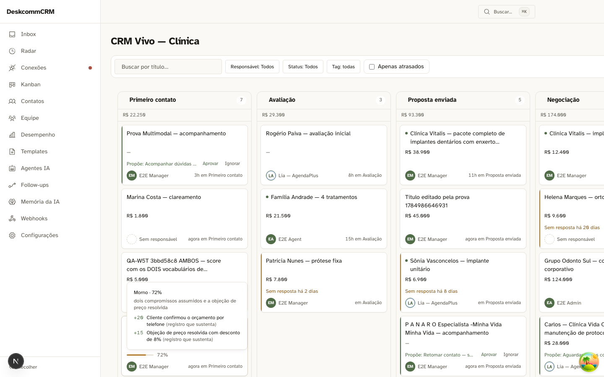

# Wave 5 — CORE 3 · score com evidência, e a faixa que não pode piscar · 2026-07-25

**Placar final: banco 18 verdes · 0 vermelhos · 0 bloqueados · tela 8 verdes · 0 vermelhos.**

> ## Os três cenários do briefing, e o que cada rótulo prova
>
> | cenário do briefing | estado |
> |---|---|
> | **15** — card mostra medidor + número; o porquê a um gesto | **FEITO** (`T15.*`) |
> | **16** — gravar score sem lastro é rejeitado pelo banco | **FEITO** (`C16.*`) |
> | **17** — lead sem sinal não mostra score inventado | **FEITO** (`T17`) |
>
> Meus rótulos internos eram `15.a..15.j` e provavam o cenário **16** — ler
> "15 verdes, cenários 15.a–15.j" levava direto a concluir que o cenário 15
> estava pronto quando ele não tinha começado. Renumerados para `C16.*` (a
> constraint), `H.*` (a histerese, que é condição acrescentada ao contrato e não
> cenário do briefing) e `T15`/`T17` (a tela). **Placar que parece cobrir o que
> não cobre é pior que placar ausente: ninguém vai atrás do que já parece feito.**

| | |
|---|---|
| Carimbo | `HEAD=1ff6990`, cinco dependências declaradas, **todas limpas** |
| Aparato | `tests/capture-wave-5-cenarios.ts` (modo normal e `SELFCHECK=1`) |

> **Recarimbada depois da mudança de schema.** O primeiro placar (15/0/0 em
> `c8156e3`) valia para o estado em que as colunas do score moravam em
> `crm_leads`; a migration 0075 as moveu para `crm_lead_scores`. Alvo que se move
> depois da medição não invalida a medição — invalida o **alcance** dela. Este
> placar é o de depois da mudança, e a migration 0075 entrou nas dependências
> declaradas do carimbo.

## O que a mudança de schema revelou no MEU instrumento

Ao rodar contra a tabela nova, **seis das oito linhas da tabela-verdade
continuaram verdes** — e estavam erradas. A coluna tinha sumido de `crm_leads`,
então toda escrita falhava com `42703` (coluna inexistente), e eu só perguntava
*"o banco recusou?"*. Um teste que afirma "score sem razão é recusado" ficou
verde num banco onde a coluna do score não existia mais.

A asserção agora exige o código **`23514`** — violação de CHECK. Qualquer outro
código significa que o caso está mal montado, e isso é falha do instrumento, não
do produto. **"Recusou" não é a pergunta; "recusou pelo motivo certo" é.**

## O defeito dos dois vocabulários — e por que a cerca dele fica barata

Durante a wave, o `CHECK` contava `activity_ids`/`message_ids`/`checkpoint_ids` e
o board lia `evidence.factors`. **Interseção vazia**: um score gravado como a
constraint exigia mostrava *"Sem evidências registradas"* na tela, e um gravado
como a tela lia era recusado pelo banco. A lei do porquê estava sendo cobrada
numa chave que a UI nunca lia — e o score podia nascer *com* evidência para o
banco e *sem* evidência para o humano, que é a pessoa para quem a lei existe.

Provado por A/B com par de controle: sem o segundo lead, o vermelho teria duas
explicações — "a tela não sabe mostrar evidência" e "a tela lê outra chave" — e
nenhuma conclusão.

**O conserto não corrigiu o defeito: tornou-o inescrevível.** A constraint passou
a exigir `factors` não vazio **com a âncora dentro**
(`evidence @? '$."factors"[*]."ancora"'`). Os dois vocabulários viraram um, e a
âncora deixou de poder existir sem a frase que a explica.

### A pergunta que decide a permanência de cada cerca

*Depois do conserto, alguém ainda consegue escrever o estado ruim?*

| cerca | o estado ruim ainda é escrevível? | consequência |
|---|---|---|
| `C16.l` / `C16.m` — âncora fora de `factors`, factor sem âncora | **não** — o banco recusa | guarda a **eliminação**: existe para o dia em que alguém afrouxar a constraint |
| `T15.d2` — as evidências gravadas aparecem | **não**, pela mesma trava | virou cerca: perdeu a pergunta original e ganhou a guarda |
| `H.c` / `H.d` — a faixa nunca fica a duas da régua crua | **sim** — é código, e código volta | guarda **comportamento**: tem de continuar rodando sempre |
| `T15.b` — a faixa exibida é a persistida | **sim** — derivar do número é uma linha | guarda comportamento |

Cercas que guardam eliminação são baratas e raras; as que guardam comportamento
precisam rodar sempre. **São durabilidades diferentes, e por isso custos
diferentes.**

## As capturas da tela

| prova | imagem |
|---|---|
| card com score 72 e faixa `morno` persistida |  |
| o par: um card com score ao lado de um sem |  |

As duas nasceram de **caso construído**, e o nome do arquivo diz isso: o dado
real não tem o par zero/ausente, e prova fabricada sem o rótulo sugere um fluxo
que ninguém exercita.

## O que faltava está MEDIDO, não omitido

Gravei um score de 72 num lead da demo, abri o board e olhei o card: nenhum
número, nenhum medidor. O card continua dizendo apenas título, valor, dono e
estágio. Nenhum arquivo de aplicação referencia `crm_lead_scores` — por isso os
três entram como **BLOQUEADO**, que acusa quem planejou, e não como reprovação de
quem construiu.

O cenário **17** merece o destaque, porque é o verde vazio perfeito: *"lead sem
sinal não mostra score inventado"* é trivialmente verdadeiro num produto que não
mostra score **nenhum**. Medido hoje, ele passaria — e passaria pelo motivo
errado. Fica preso ao 15.

## O resto desta wave não tem imagem, e isso é um dado

Não há captura porque **não há tela**: a faixa (`frio`/`morno`/`quente`) ainda não
chega ao card — o slot mostra o medidor e o número, não o rótulo. Fabricar um
print aqui seria fabricar prova. Fica **nomeado como lacuna**: no minuto em que a
faixa subir para o card, a Wave 5 passa a precisar de prova visual que hoje não
existe, e o sintoma que essa prova procuraria é o card dizendo "Frio" ao lado de
72%.

## Lacunas NOMEADAS (não são esquecimento)

| lacuna | por que ficou aberta |
|---|---|
| **Foco por teclado não revela o porquê** | O hover revela e o clique também — quem usa toque alcança. O foco por teclado **não abre**. Isso é acessibilidade, e merece critério próprio em vez de virar apêndice do hover: embutido aqui, ele seria julgado pela régua errada e sumiria no verde do gesto que funciona. Vira item quando a entrega chegar em acessibilidade. |
| **A faixa não tinha imagem enquanto não chegou ao card** | Ver a seção abaixo — ausência de tela registrada como dado. |

## A) A lei mora no banco — então se cobra do banco

Ler a migration prova que **alguém escreveu** a constraint. Não prova que ela foi
aplicada, nem que pega o caso do array vazio que a própria migration nomeia como
armadilha. Tabela-verdade de oito linhas contra Postgres real, dentro de
transação desfeita no fim:

| caso | veredito do banco |
|---|---|
| score com razão e lastro | **aceito** |
| score sem razão | recusado `23514` |
| razão só com espaços | recusado |
| razão sem lastro nenhum | recusado |
| `activity_ids: []` | recusado |
| ausência de score | **aceito** |
| score 101 | recusado |
| faixa `morninho` | recusado |

As duas linhas em negrito são o que faz "recusou" significar alguma coisa: se
tudo fosse recusado, a asserção não distinguiria uma constraint correta de uma
que recusa qualquer escrita.

### A borda foi descoberta, não afirmada

O briefing escrevia `score ≤ 45` num parágrafo e `< 45` no outro. Reprovar por
essa diferença seria reprovar o produto por defeito do **texto** — e, mais
honestamente: eu tinha dois números defensáveis e nenhum critério para escolher.
**Asserção que não se justifica sem chutar não é asserção, é preferência.**

Então varri 0..100 por faixa e li de volta o que o banco aceita. O intervalo
virou **saída**, não disputa:

```
frio 0..45 · morno 35..75 · quente 65..100   (bordas inclusivas)
```

### A inclusão deixou de ser declarada

O briefing afirmava que o conjunto **aceito** pelo CHECK é superconjunto do
conjunto **produzido** pela caminhada — e que precisa ser, senão rejeitaria
escrita legítima na fronteira. O critério 15.j percorre os 303 estados, pergunta
à função de produção que faixa ela devolve e manda o par ao Postgres pelo mesmo
caminho do worker: **303 gravaram**. Não há par produzível fora do aceito.

E ele não é verde por ausência: sem constraint, tudo gravaria. Quem impede a
vacuidade é o critério vizinho, que prova a **mesma** trava recusando a zona
incoerente. Uma é a perna positiva da outra.

## B) A histerese, com o valor dançando

"Não pisca" é propriedade **fraca**: uma faixa que nunca muda também não pisca.
São três, e as duas últimas foram o que achou o defeito.

| propriedade | o que afirma |
|---|---|
| ANTI-PISCA | série oscilando em volta de **cada** limiar muda a faixa no máximo uma vez |
| NÃO-MENTIRA | a faixa nunca fica a **duas** faixas da régua crua |
| FIDELIDADE | a função concorda com a régua escrita no próprio módulo |

### Varredura, não exemplos

Exemplo escolhido a mão acha o que quem escreveu já suspeitava. Meus quatro
exemplos acharam quatro casos; a varredura do domínio inteiro — 101 scores × 3
faixas anteriores — achou **nove**, e deu a forma:

```
vindo de "frio",   score 70-74 exibe "frio"    (a régua crua diz "quente")
vindo de "quente", score 36-39 exibe "quente"  (a régua crua diz "frio")
```

Contíguas, e só na zona do meio: fora dela a função acertava. **Defeito com forma
precisa, não instrumento quebrado** — e a saída comprime as violações em faixas
justamente porque nove linhas soltas mostram nove casos e deixam a forma para
quem lê adivinhar.

### O episódio da divergência

A meio caminho do conserto, os instrumentos **discordaram**: não-mentira 5/303,
escrita real 5/303, fidelidade 9/303. Instrumentos independentes que divergem
significam mais de um defeito ou um instrumento errado — hora de parar de
consertar e voltar a medir.

Tinha conteúdo: a descida havia trocado um defeito por outro. Era **rótulo velho**
(parava duas faixas atrás), virou **degrau perdido** (pulava `morno` e ia direto a
`frio`). Só a fidelidade via — a não-mentira não, porque `frio` *é* a régua crua
ali; a escrita não, porque o banco aceita os dois em 38.

No fim os três voltaram a 0/303, e concordarem é a evidência de que era **um**
defeito, não dois sobrepostos.

## A cerca de regressão, e a prova de que ela morde

Zerar as violações quebrando os acertos é **troca de defeito, não correção**. Daí
14 âncoras escritas **à mão** a partir da régua declarada — derivá-las de qualquer
uma das fórmulas faria a cerca concordar com o instrumento que deveria vigiar.
São as bordas: o primeiro valor que confirma cada transição e o último que não.

E a cerca não fica só afirmada. `SELFCHECK=1` a submete ao conserto **errado** mais
plausível — devolver sempre a régua crua:

| | |
|---|---|
| a régua crua zera a varredura | **0 violações** — pareceria consertado |
| o anti-pisca a reprova | 6 trocas na série oscilante (limite 1) |
| as âncoras a reprovam | 4 de 14 quebradas |

O atalho passa na invariante nova e é barrado pelas outras duas. **Cerca que nunca
reprovou é decoração**; e cerca que só morde antes do conserto caduca junto com o
bug — esta continua mordendo depois.

> Nota de higiene: o auto-teste **não** muta `lib/kanban/score-band.ts`. O caminho
> óbvio era mutar a função real, como nos outros casos desta entrega — e foi
> recusado porque o arquivo estava sendo escrito por outra sessão naquele minuto.
> Mutação vale contra código commitado ou próprio, nunca contra arquivo que outra
> sessão tem aberto: o dano não apareceria como erro, apareceria como resultado
> que ninguém consegue reproduzir.
