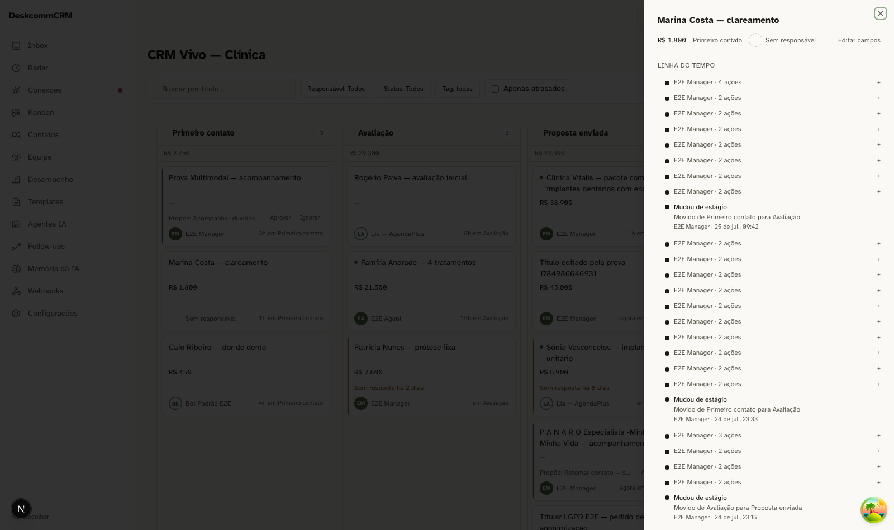
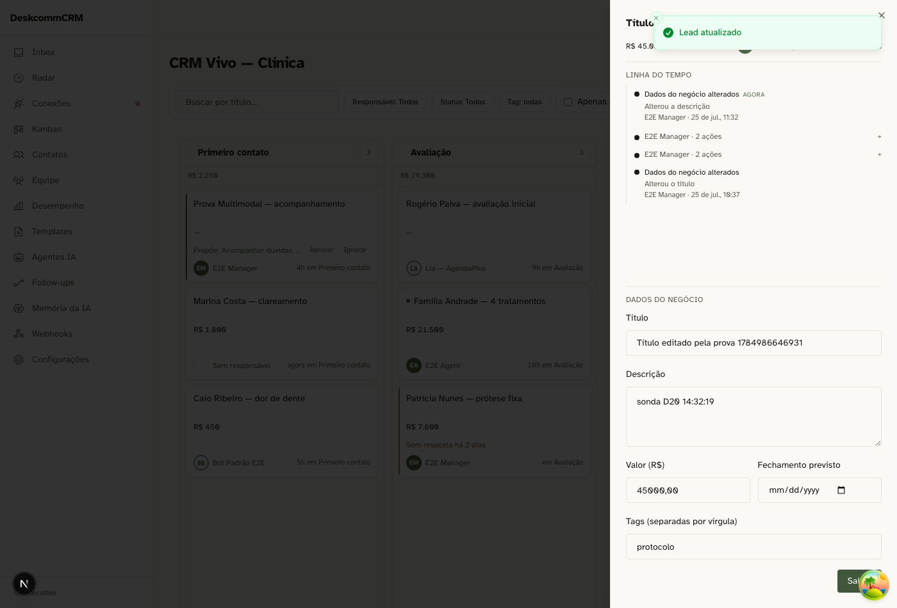
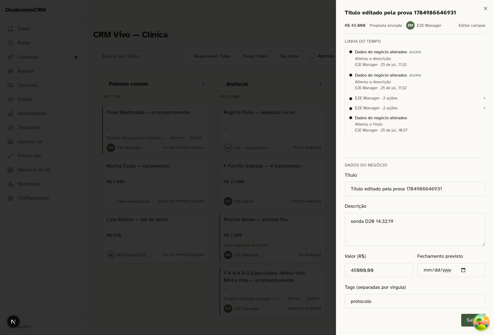

# Wave 6 — o dossiê do negócio · 2026-07-25

Três provas de tela, e as duas primeiras existem porque a terceira expôs um
defeito de eixo que nenhuma delas teria pego sozinha.

| | |
|---|---|
| Carimbo | `dc03a74` (eixo) e `e340882` (registro de edição), árvore limpa nos arquivos envolvidos |
| Aparato | `tests/sonda-dossie-d20-d21.ts` |

## D24 — o negócio SEM contato deixa de dizer "nada aconteceu"

O dossiê usava a timeline do CONTATO, indexada por `contact_id`. Negócio sem
contato não tinha porta de entrada nenhuma, e a tela afirmava "Nada aconteceu
com este negócio ainda" para um lead com 111 atividades registradas.

Medido antes do conserto: **14 de 55 leads sem contato (25%)**, carregando
**126 de 198 atividades (64%)**. Não era caso de canto.

O defeito não estava NA peça — a timeline do contato está correta sobre o
contato. Ela foi reusada como dossiê do negócio, que é outro substantivo. E as
duas falhas se leem idênticas na tela: **vazio por falta de EIXO tem a mesma
aparência de vazio por falta de ACONTECIMENTO**.

| Alvo | Rota | Da própria linha | Órfãs | De OUTRO negócio |
|---|---|---|---|---|
| `fd24dd44` (111 atividades, sem contato) | 200 · 100 itens | 100 | 0 | 0 |
| controle (com contato) | 200 · 5 itens | 5 | 0 | 0 |

O controle é o que sustenta a prova: 100 itens aparecendo seria compatível com
"a cláusula pegou tudo demais". O lead com contato devolvendo 5 e **zero de
outro negócio** exclui essa hipótese. Sem ele, eu teria provado que a porta
abriu — não que abriu no lugar certo.

## D20 — editar pelo dossiê registra, e não fecha o Sheet

Quem edita precisa VER o registro que acabou de gerar; fechar esconderia a prova
justamente de quem a produziu.

| Verificação | Resultado |
|---|---|
| Sheet continua aberto | sim |
| A linha entra marcada "agora" | sim |
| O texto digitado NÃO vaza para a linha | sim — o reason nomeia o campo, nunca o valor |
| Nomeia SÓ o campo alterado | sim, **depois do conserto** |
| Salvar sem mexer em nada não registra | sim — e o PATCH SAIU (1 requisição, `updated_at` mudou no banco) |

O defeito que esta prova achou: mudei apenas a descrição e a timeline registrou
*"Alterou o título, a descrição, o valor, a data prevista de fechamento e as
tags"*. O formulário envia o form inteiro a cada salvamento e o handler lia
ENVIO como ALTERAÇÃO. Registro que afirma o que não aconteceu é pior que
registro nenhum: entra na auditoria, e quem investigar "quem mexeu no título?"
acusa a pessoa errada.

As duas últimas linhas da tabela andam juntas de propósito. "Não registrou"
passaria igualzinho se o clique não tivesse feito nada — o teste acertaria pelo
motivo errado e provaria o oposto do que afirma.

## D21 — ação de outra aba entra ao vivo

`PATCH` disparado de uma segunda aba pela rota real que a UI usa; a aba do
dossiê **não** é recarregada. A linha entra, marcada, com o canal `subscribed`.
