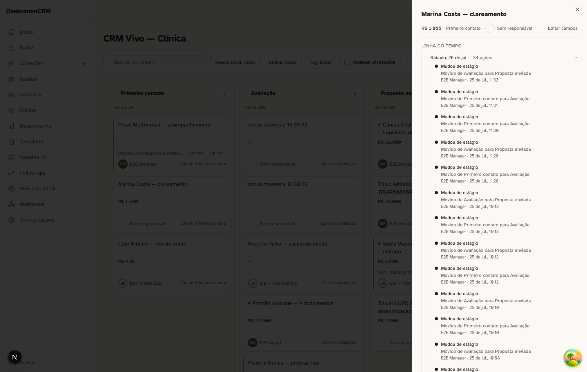
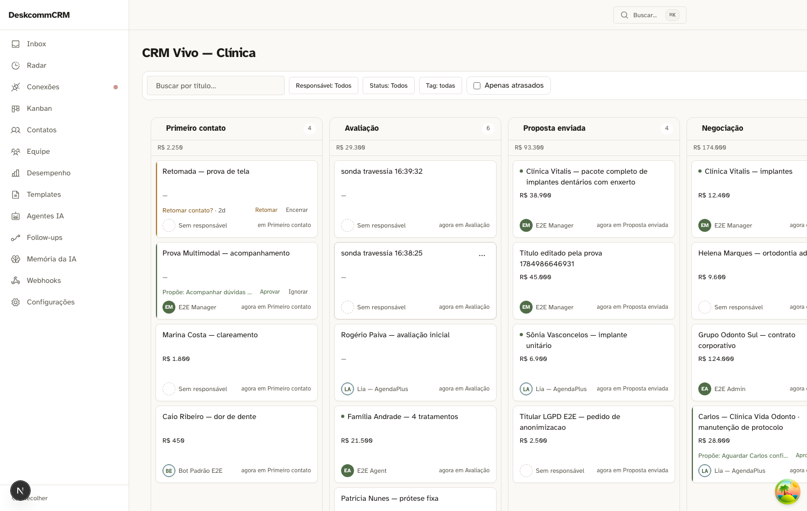
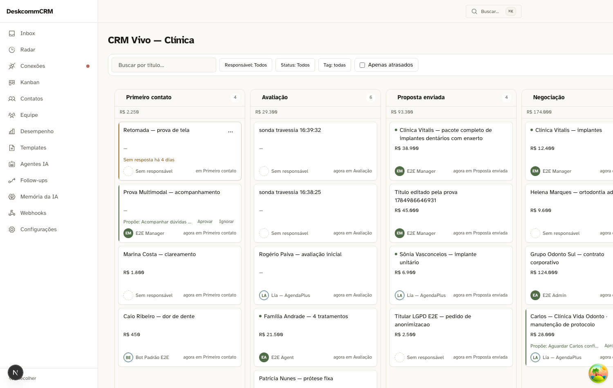
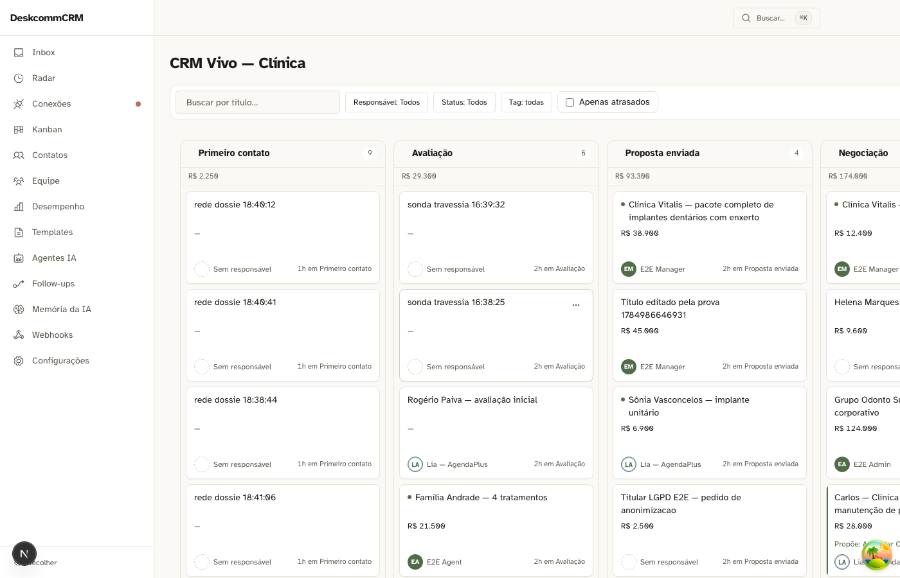
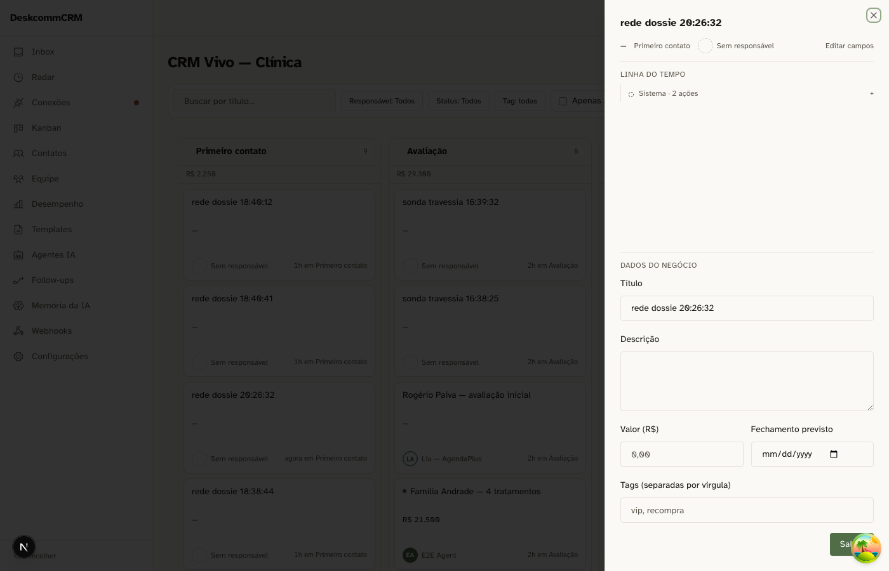
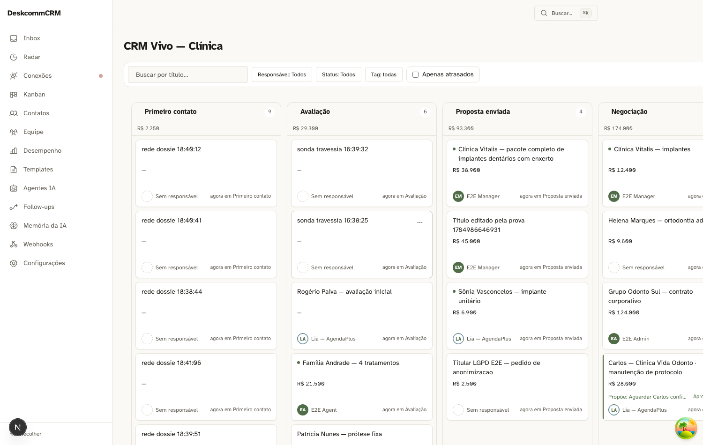

# Wave 7 — o ciclo · 2026-07-25

"Esfriando" era adjetivo calculado dentro de rotas de leitura: não existia até
alguém abrir a tela. A wave o transforma em **estado do negócio**, com produtor,
registro e destino humano.

| | |
|---|---|
| Peças | 1 tabela · 2 relógio do silêncio · 4 acervo · 5 observador da travessia |
| Segurada | 3 (board assinando a tabela) — depende de entrega em tempo real |
| Aparato | `tests/sonda-worker-travessia.ts`, `scripts/seed-risk-states.ts` |

## O ciclo, ponta a ponta

Rodado pela sonda, com o gatilho honesto: o negócio esfria porque **o relógio
andou**, e o worker roda sem ninguém tocar a linha do lead.

| Passo | Estado | Timeline |
|---|---|---|
| negócio novo | `em_dia` | vazia |
| após 100h de silêncio | `em_risco` | "Negócio esfriou" |
| segunda passada do worker | `em_risco` | inalterada — 0 travessias |
| após interação real | `em_dia` | "Negócio voltou a andar" |

**O worker não tocou nenhum lead** — hash de `(id, updated_at)` de todos os leads
da org idêntico antes e depois. Ele não pode tocar nem pelo trigger: os tipos que
emite estão fora da lista positiva da 0079. A peça 2 foi decidida por outra razão
(tipo novo tem de falhar barulhento) e acabou garantindo isto de graça.

Pela rota real: `403` sem segredo; com segredo, 4 orgs e 10 travessias na
primeira passada, **0 na segunda**.

## O acervo entra sem mentir

36 críticos e 2 em risco de 56 abertos, todos gravados com `since` no passado —
eles esfriaram há dias, e "esfriou agora" seria falso na única superfície que
promete contar a vida do negócio.

| Promessa | Resultado |
|---|---|
| atividades de risco na timeline | 0 |
| estados com `since` no futuro | 0 |
| itens de caixa após 3 execuções | 1, o mesmo id nas três |
| o seed tocou algum lead? | não — hash idêntico |

O item diz o trabalho, não o número: **"Revise 38 negócios parados e decida quais
encerrar"**.

## O agrupamento por dia



O dossiê daquele lead tinha **25 linhas, 22 delas o bloco idêntico "E2E Manager ·
2 ações"**. O agrupamento estava correto (janela de 60s, episódios distintos) e o
resultado não informava nada.

Agora: **2 blocos de dia** representando as mesmas 50 ações — "sábado, 25 de jul.
· 34 ações" e "sexta-feira, 24 de jul. · 16 ações". Abrir um revela as 34 linhas.

O gatilho é o **tamanho da lista**, nunca o tempo. Calibrar por tempo exigiria
escolher uma janela olhando os dados disponíveis, e os dados disponíveis são
artefato das próprias sondas — medido, o intervalo mediano entre atividades é de
99s contra uma janela de 60s. Ajustar ali seria produzir um número sobre nós
mesmos com cara de resultado sobre o produto.

E o caso que decidiu o desenho não é o muro de blocos: é o lead com **26 itens e
26 blocos, zero colapsáveis** — ausência de estrutura acima da linha, que é a
forma mais comum. Por isso o agrupamento parte dos itens, não dos blocos finos.

## O card da proposta (cenário 23)



A faixa ③ ganha um quarto estado. A precedência ficou
`awaiting > reactivation > cooling > medidor`, e ela separa **informar** de
**permitir agir**: `cooling` diz "este negócio parou", a proposta diz "parou e
aqui está o que fazer". Continua perdendo para a próxima ação do agente, por
coerência com o cenário 24 — duas decisões pendentes no mesmo card é a pilha que
o contrato de UI proíbe.

| Verificação | Resultado |
|---|---|
| a faixa mostra a proposta | sim |
| mostra o **prazo** | sim — "· 2d" |
| os dois botões decidem | Retomar / Encerrar |
| o card cresceu? | não — 144px com e sem proposta |
| decidir tira a oferta da tela | sim, **depois do conserto** |

O prazo aparece no card de propósito: proposta com prazo que **não mostra o
prazo** é a mesma simulação de atenção que o prazo existe para evitar — quem
olha precisa saber que a janela fecha, senão "decido depois" é indistinguível de
"decidi não".



E o último item achou defeito real: o servidor respondia `accepted` e **o card
seguia oferecendo o botão**. O hook invalidava só `["board", pipelineId]`, e a
lista de propostas vive em `["reactivations"]` — um lado mudou, o outro não
acompanhou, e ninguém reclamou. Clicar de novo daria 409, e o usuário concluiria
que o sistema não obedeceu.

---

# Fechamento da wave 7

## O que entrou

| Peça | O que virou |
|---|---|
| 1 · tabela | `crm_lead_risk_states` — "esfriando" deixa de ser adjetivo calculado |
| 2 · relógio | a lista positiva da 0079: constatar o silêncio não o quebra |
| 4 · acervo | 38 negócios já frios entram sem mentir, com **um** item de caixa |
| 5 · observador | o cron que faz o estado acontecer sem ninguém olhar |
| 23 · ciclo | proposta com prazo → decisão humana ou vencimento → envio real |
| — | timeline longa agrupa por dia (o muro de 22 blocos virou 2 linhas) |

## O que ficou BLOQUEADO — e por quê

> ⚠️ **ATUALIZADO no fim da wave: eram dois, ficou um.** O cenário 22 destravou
> — não pelo realtime, mas pela rede de segurança. Ver a seção final. Este
> parágrafo fica como estava escrito, com a correção acima, porque apagá-lo
> esconderia que o bloqueio existiu e como saiu.

Os dois estavam presos ao **mesmo** veredito, e nenhum deles era trabalho
pendente por falta de tempo:

- **peça 3** — o board assinando `crm_lead_risk_states`; **segue bloqueada**, e
  agora por um motivo menor: virou otimização de latência, não a única via —
  com a rede, o board já se atualiza sozinho;
- **cenário 22 na tela** — o card mudando sem reload. **DESTRAVADO**, provado na
  janela do worker.

Ambos exigem entrega em tempo real, e a entrega está em disputa entre dois
aparatos: às 14:26 o CRM Vivo dava 0/2 com controle vivo; às 14:50 passou a dar
2/2, e a varredura completa das 55 linhas deu 55/55. **Construir em cima disso
produziria trabalho que não pode ser provado.**

O que se sabe: houve três defeitos de realtime no dia (memo de falha, assinatura
anônima, `setAuth` sem `await`), todos consertados e provados por par. O que
resta não é explicado por nenhum deles — a assinatura anônima já não existia
quando o 0/2 foi medido.

## Os defeitos que a wave achou (e que ninguém tinha pedido)

O padrão se repetiu seis vezes, em seis camadas: **um lado do contrato mudou e o
outro não acompanhou, sem nada reclamar.**

| Onde | O que era |
|---|---|
| trigger × radar | a atividade que registrava o silêncio zerava o relógio do silêncio |
| relógio × relógio | `since` do banco contra `detected_at` do processo, 2s de deriva |
| upsert × default | o default só vale no INSERT; no UPDATE a coluna guardava o valor antigo |
| formulário × handler | o form manda tudo, o handler lia envio como alteração |
| rota × contato | `cron_jobs` é por contato, e 26 de 68 negócios não têm contato |
| cache × cache | o board invalidava, a lista de propostas não |

## O que a wave deixou visível e não resolveu

**Um quarto dos negócios abertos não tem caminho automático de retomada** (26 de
68, sem contato). Eles continuam esfriando e aparecendo no radar; a saída deles
é humana. Isso não é regressão — é uma lacuna que só apareceu porque a proposta
passou a existir para revelá-la.

---

## A rede de segurança (fora do escopo da wave, e a peça mais valiosa dela)



Uma peça com três papéis, e ela responde ao único achado do dia que atravessou
três retratações intacto: **quando a entrega morre, nenhuma tela avisa**.

| | canal trouxe | o card apareceu | divergências |
|---|---|---|---|
| entrega **morta** | não | **sim** | 0 → **1** |
| entrega **viva** (controle) | sim | sim | 0 → **0** |

O par é o que prova. Só o lado morto mostraria a cura e não distinguiria "a rede
funcionou" de "o canal funcionou"; só o lado vivo não mostraria nada. Juntos:
**cura nos dois casos, denuncia só quando há o que denunciar** — um detector que
gritasse sempre seria desligado na primeira semana.

### E no dossiê também — o par completo

| | canal trouxe | apareceu na tela | divergências |
|---|---|---|---|
| board · entrega **morta** | não | sim | 0 → **1** |
| board · entrega **viva** | sim | sim | 0 → 0 |
| dossiê · entrega **morta** | não | sim | 0 → **1** |
| dossiê · entrega **viva** | sim | sim | 0 → 0 |



### Três aparatos descartados antes de um funcionar

Matar a entrega parecia trivial e não era. Cada tentativa media outra coisa:

| tentativa | o que realmente acontecia |
|---|---|
| `page.route` | intercepta HTTP, **não** WebSocket — o canal entregava, e o "curou" era o realtime funcionando |
| `throw` no construtor | derrubava a página com *Runtime Error* do Next: **app quebrado**, que é outra condição |
| stub artesanal de `WebSocket` | o canal seguia `subscribed` — o stub nem estava em uso, e eu media um canal vivo achando-o morto |
| **`page.routeWebSocket`** | o canal fica em `connecting` e nunca entrega: **o defeito real** |

O que revelou cada erro foi sempre uma linha defensiva escrita antes de precisar
dela — "o canal trouxe? SIM ← o bloqueio falhou" — e o `data-realtime-status`,
que respondeu se o bloqueio tinha pegado quando "não chegou nada" era
indistinguível de "o refetch chegou primeiro".

**E o instrumento errou mais uma vez depois disso**: eu contava `<li>`, e as duas
atividades da sonda são do mesmo ator em menos de 60s — o agrupamento que **eu
mesmo construí** junta as duas num bloco, a contagem fica igual, e a cura parece
não ter acontecido. Passou a contar AÇÕES REPRESENTADAS, colapsadas ou não.

---

## Nota sobre as evidências: elas foram REVERTIDAS, não regeneradas

Quinze capturas apareceram com **conteúdo alterado** no fim da wave — 8 da wave
3, 6 da wave 4 e 1 da wave 6. Uma delas dobrou de tamanho (61KB → 126KB). Não
foi edição: foram sondas re-executadas sobre um banco que continuou vivendo.

Abri a que mais mudou (`wave-3-c11-timeline-veto.png`). A legenda promete a
linha "Envio bloqueado — não enviei: limite de ritmo de envio atingido", e ela
**está lá** — no topo, sob o cabeçalho "ONTEM". Mas está lá **por sorte de
ordenação**: a timeline ordena do mais recente para o mais antigo, e com mais um
dia de atividade aquela linha desce e sai do enquadramento. A legenda passaria a
afirmar o que a captura não mostra, sem nada quebrar.

**Por isso as quinze foram revertidas para as versões commitadas.** Evidência de
wave fechada documenta um INSTANTE que sustentou um veredito; regenerá-la
substitui a prova por outra foto, tirada de outro estado do mundo. Quando a nova
ainda mostra o que a legenda diz, é coincidência — e coincidência que passa
despercebida vira legenda falsa na próxima vez.

A regra que fica: **sonda de wave fechada roda para verificar, nunca para
sobrescrever.** Se a re-execução precisar virar prova, ela vira prova NOVA, com
nome e legenda próprios — não por cima da antiga.

### A exceção que esta regra não previu — e que eu descobri violando-a

As duas capturas da rede (`wave7-rede-de-seguranca.png` e `wave7-rede-dossie.png`)
**foram sobrescritas**, em 25/07, por ordem do orquestrador. Isso contradiz o
parágrafo acima na letra, e não no espírito — a diferença é **o que mudou**:

| | mudou | a prova antiga… |
|---|---|---|
| as quinze | o **banco** viveu; o código não mudou | …ainda sustentava seu veredito. Regenerar troca a prova por outra foto do mundo. |
| as duas da rede | o **código** mudou (`9d5b1f5`) naquilo de que a asserção depende | …deixou de sustentar veredito nenhum. |

A asserção é "canal vivo ⇒ 0 divergências". Com a leitura de ref congelada, ela
**podia ter falhado** e não falhou por acaso de tempo — então a captura antiga
era compatível com o código velho *e* com o novo: registrava um resultado que
teria sido o mesmo de qualquer jeito. **Não havia veredito antigo a preservar**,
e é por isso que sobrescrever foi o certo aqui.

O critério que separa os dois casos: *a prova antiga ainda discrimina entre o
mundo em que a afirmação é verdadeira e o mundo em que ela é falsa?* Se sim,
preserve. Se não, ela já não é prova — e manter uma não-prova pelo nome do
arquivo é pior que substituí-la.

---

## A janela do worker — e o cenário 22 DESTRAVOU



O ciclo inteiro com a tela aberta e **ninguém tocando em nada**:

```
ANTES   o card diz "Sem resposta há 8 dias" — nenhuma ação oferecida
WORKER  http 200 · 1 travessia · 1 esfriou · 1 proposta criada
~60s    o card passa a oferecer "Retomar contato? · 24h  [Retomar] [Encerrar]"
DEPOIS  sem reload, sem clique, sem interação
```

**Isto estava declarado como BLOQUEADO no fechamento**, e o bloqueio caiu por um
caminho que não era o esperado: não foi o realtime que resolveu — foi a rede de
segurança. O que dependia de uma investigação em disputa passou a depender de
uma peça que **não pode mentir**, porque é requisição com resposta.

Os ~60s são o polling declarado da lista de propostas, que não vem por canal —
não há perda a curar ali, há latência. A primeira medição esperou 7s e concluiu
"o ciclo não chegou à tela": estava medindo a minha impaciência, não o produto.
O contrato pede **sem reload**, não instantâneo.

---

## Consequência de DEPLOY descoberta (não é da wave 7 — e é maior que ela)

O cenário 23 agenda o envio por `cron_jobs` + `followup_turn`, que é **o caminho
que já existe** para o agente falar com o cliente. A escolha está certa: criar um
segundo caminho de envio seria o mesmo erro de ter duas definições de
"esfriando".

**Mas o produto tem DOIS mecanismos de agendamento que custam coisas diferentes
para OPERAR:**

| mecanismo | quem drena | o que o self-host precisa |
|---|---|---|
| `followup_enrollments` | rota de cron (`followup-flow-worker`) | nada além do agendador HTTP que já existe |
| `cron_jobs` | `fireOneDue`, dentro do **agent-worker** | **um processo vivo** (`npm run worker`) |

E num produto self-host isso é um defeito de entrega esperando acontecer:
alguém instala o kit, aceita uma reativação, o sistema responde **"agendado"** —
e a mensagem nunca sai. Sem erro, sem aviso, sem nada ligando sintoma a causa.
É a doença do épico inteiro, agora no manual de instalação.

**A prova de que o mecanismo está inerte neste ambiente**, medida em dois
andares:

```
cron_jobs  · 22 followup_turn · 7 vencidos · attempts = 0 em TODOS
job_queue  · 7 pendentes depois do tick     · attempts = 0 em TODOS
```

`attempts = 0` não é "tentou e falhou" — é **nunca foi tentado**. Nenhum
consumidor jamais pegou nenhum desses jobs aqui.

E a cadeia completa, com um consumidor diferente em cada seta:

```
cron_jobs ──tickCron──▶ job_queue ──agent-worker──▶ turno do agente ──▶ mensagem
   ✅ provado              ⛔ sem processo vivo
```

O `agent-dispatcher` **não** cobre o segundo elo: está marcado `@deprecated` e é
no-op permanente desde a convergência da Fase 0.

### A regra que fica

Ao escolher entre mecanismos que fazem a mesma coisa **no código**, conte
**quantos processos precisam estar vivos** para cada um. A diferença não aparece
em teste — aparece na máquina de quem instalou. E quando a escolha custa um
processo a mais, isso vira **requisito declarado do deploy**, não detalhe de
implementação.

### O item que fica aberto (decisão de produto, não de código)

Ou o kit self-host declara e sobe o agent-worker, ou o envio da reativação migra
para o mecanismo que não exige processo. As duas são decisões de produto. Nada
foi mudado — só registrado.
