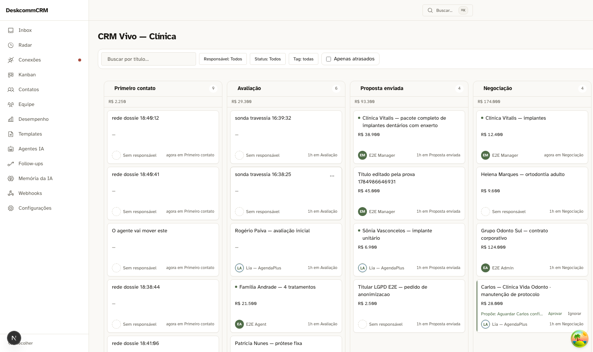
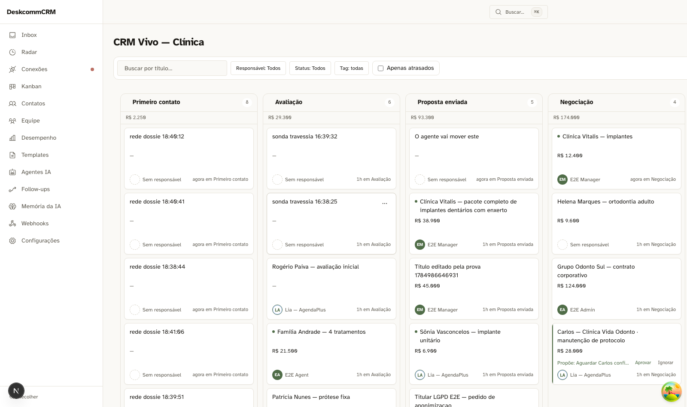

# Wave 8 — o funil do agente e o funil do tenant · 2026-07-25

## Cenários 25 e 26 — o agente move o card, em qualquer vocabulário




O agente pensa em sete passos fixos; o tenant nomeia os dele. A ponte é
`crm_stages.agent_stage_hint` (migration 0084).

```
ANTES    o card está em "Primeiro contato"
AGENTE   avança o funil dele para "negotiating"  ·  ninguém toca na tela
~8s      o card está em "Proposta enviada"
```

E o mesmo passo cai em lugares diferentes conforme o nicho — que é o cenário 26:

| nicho | agente pede | o card vai para |
|---|---|---|
| clínica | `negotiating` | **Proposta enviada** |
| e-commerce | `negotiating` | **Aguardando pagamento** |
| e-commerce | `qualifying` | **não move** — o pipeline não declarou |

### O que o resolvedor recusa fazer

- **Sem mapeamento não move, e não há fallback por proximidade.** Mandar o
  negócio para "o estágio mais próximo" inventaria semântica que o tenant não
  declarou, e o usuário veria um card se mexendo sozinho para um lugar que
  ninguém escolheu. Pipeline sem hint nenhum — o estado de **todo clone novo** —
  nunca move.
- **Estágio arquivado não é destino**: sumir do board é pior que não se mover.
- **Contato com dois negócios abertos**: reusa `resolveActiveLeadForContact`, a
  decisão da wave 4. Ambíguo não move nenhum.
- **Ambiguidade de hint não é tratada**, deliberadamente: a 0084 a tornou
  impossível no banco. Tratar no código protegeria contra um estado que não pode
  existir — e faria o próximo leitor acreditar que pode.

### A trava que não foi pedida

A escrita é condicional ao **estágio de origem**. Se um humano arrastou o card
entre a leitura e a escrita, o agente não atropela: o resultado vira
`ja_esta_la`. Sem isso, uma decisão humana seria desfeita em silêncio, e a
pessoa veria o próprio gesto revertido sem explicação.

### Uma gramática só

A atividade usa o **mesmo** `stageChangeReason` do arrasto humano — "Movido de
Primeiro contato para Proposta enviada" — com `actor_kind = system`. Quem moveu
é **campo**, não texto: duas frases para o mesmo acontecimento fariam cada
leitor, cada filtro e cada tradução carregarem as duas para sempre.

---

# O defeito de preview que não existia — uma retratação, e o que ela ensina

Interrompi a wave 8 para investigar um defeito que **eu inventei**. O registro fica
aqui inteiro porque o erro custou mais que qualquer entrega do dia: levou o
orquestrador a aprovar uma migration de schema, e travou um cenário do QA.

## O que eu reportei

Que `conversations.last_message_preview` ficava para trás: **11 conversas defasadas,
mediana 0h, máxima 69 dias**. Pedi um trigger para carimbar a conversa a cada
mensagem inserida, e ele foi aprovado — com duas consequências declaradas (dobrar o
tráfego de realtime, já que `conversations` está na publicação; e conferir se alguma
trava otimista dependia de `updated_at`).

## O que era de verdade

Eu comparei o carimbo da conversa com `max(messages.created_at)`. **O sistema carimba
por `max(coalesce(sent_at, created_at))`** — a hora do *envio* no WhatsApp, não a hora
em que a linha entrou no banco. A migration 0027 (unificação de conversas) agrega
assim, e está certa: a caixa de entrada ordena por quando o cliente falou, não por
quando o banco soube.

Nas mensagens que a 0027 **repontou**, as duas horas divergem por meses — `created_at`
é o instante da importação, `sent_at` é o instante real.

| régua | defasadas |
|---|---|
| envio (`coalesce(sent_at, created_at)`) — a que o sistema usa | **1 de 28** |
| inserção (`created_at`) — a que eu usei | 11 de 28 |

E a única que sobra na régua certa tem `external_id` nulo: **inserção direta, sonda
minha**. Não é do produto.

A prova de que era isso, e não coincidência: as 5 "defasadas do WAHA" têm `updated_at`
= **07/07 00:16, todas, ao minuto** — o instante em que a 0027 rodou (14 conversas
tocadas naquela hora). Elas não esqueceram de atualizar; foram recalculadas pela
migration, pela régua do envio, e ficaram **certas**. Meu comparador chamou o certo de
errado.

## O sinal que estava na cara

**"Mediana 0h, máxima 69 dias" não é a assinatura de um mecanismo que falha às vezes —
é a assinatura de dois relógios.** Mecanismo quebrado erra em toda parte; régua trocada
erra só onde os dois relógios divergem. Eu tinha o diagnóstico no próprio número que
reportei e passei por ele.

## O erro de instrumento que veio antes

Antes da retratação eu já tinha errado uma vez no mesmo caso: afirmei que
`lib/waha/ingest.ts` "insere mensagem e nunca toca `conversations`". Ele toca — por
`markConversation()`, que chama a RPC `fn_mark_conversation_message`. Minha varredura
procurou `from("conversations")` **dentro do arquivo**, e o ingest chega lá por RPC,
através de um helper. É a mesma família: **varredura que procura o recurso perde quem
chega nele pelos portões.**

Os dois caminhos de escrita estão íntegros e sempre estiveram — API por `update`,
ingest por RPC.

## O que ficou de conserto real

Nenhuma migration. O que a investigação produziu de útil foi:

- **`9d5b1f5`** — `useRealtimeChannel` devolvia `ultimaEntrega.current`, leitura de ref
  dentro do render: o número saía congelado e o consumidor só via o valor novo se
  *outra coisa* causasse render. Funcionava por acidente (a query redesenha ao
  invalidar) e falharia na janela entre a entrega e o redesenho — que é exatamente
  onde o refetch de segurança dispara. Ele leria carimbo velho e acusaria divergência
  numa mudança legítima. A ref agora **atravessa** a fronteira do hook; quem lê é o
  timer, fora do render. Não virou `useState` de propósito: o valor entraria nas
  dependências do efeito e o canal re-assinaria a cada evento.
- **`f2131b3`** — a sonda de redundância apaga o que insere e **confere quantas linhas
  apagou**. Mensagem inserida direto em `messages` não passa por nenhum dos dois
  caminhos, então a conversa não recebe carimbo, e o rastro ganha a assinatura de um
  defeito de preview. Foi o que sujou a medição.

## Ressalva de honestidade sobre as evidências da wave 7

As evidências da rede de segurança foram tiradas **antes** de `9d5b1f5`. O detector que
elas mostram funcionando é o que tinha a leitura congelada. A lógica do comparador não
mudou — só a frescura do dado que entra nele —, mas isso é **raciocínio, não
observação**, e a diferença é justamente a que não se deve borrar.

## Epílogo: o desencontro continuou DEPOIS de acertarmos a coluna

O orquestrador corrigiu a minha retratação: a única que sobra na régua certa não é a
minha sonda (`external_id` nulo) — é uma do WAHA, com **3,317s** de atraso. Ele está
certo, e o motivo do desencontro é o próprio tema:

**Eu filtrei atraso `> 1 minuto`; ele mediu com tolerância zero.** Os 3s dela nunca
podiam aparecer na minha lista, e a minha (carimbo nulo, atraso infinito) aparecia na
minha por construção. Acertamos a *grandeza* e continuamos com *limiares* diferentes —
**a régua tem duas partes, e a gente só tinha aprendido a declarar a primeira.**

E as duas medições nem sobre o mesmo banco foram: quando fui reconferir, as órfãs de
sonda **não existiam mais** — alguém as limpou no intervalo.

### Os 3 segundos são dois relógios, literalmente

| origem | relógio |
|---|---|
| `ingest.ts:281` — `sent_at = p.timestamp` | aparelho / WhatsApp |
| `ingest.ts:295` — `markConversation(..., now)` | servidor |
| migration 0027 — recalcula `last_message_at` por `coalesce(sent_at, created_at)` | aparelho |

A **mesma coluna** carrega relógios diferentes conforme quem escreveu por último:
depois de um recálculo é do aparelho, em operação normal é do servidor. Não é defeito e
não proponho mexer — a magnitude é irrelevante para o produto. Fica registrado porque
qualquer verificação que compare essas duas colunas vai achar segundos de diferença que
**não são defeito**, e reprovar por isso é falso vermelho.

### O conserto do instrumento — `98d2222`

`mensagemDeSonda` (em `tests/qa-helpers.ts`, junto do `escolherAlvo`) insere **e** chama
`fn_mark_conversation_message`, estourando se a RPC falhar. Devolve `apaga()`, que
remove pelo ID e exige ter casado exatamente uma linha.

Enquanto a sonda inseria direto, **cada rodada plantava um achado falso de produto** —
inclusive o "Sem mensagens" que o QA viu numa conversa que tinha mensagens.

### A segunda retratação veio da disciplina, não da dúvida

Investigando por que a limpeza da outra sonda falhara, eu já tinha a explicação pronta e
convincente — "o `LIKE` exige que o corpo *comece* pela marca". Estava errada: o código
no HEAD já põe a marca no começo, eu mesmo a movi durante a wave. As órfãs eram de uma
versão antiga. Abri o arquivo por disciplina da lei do alvo em movimento, **não porque
duvidasse** — e era o mesmo erro que eu tinha acabado de me retratar, sendo reconstruído
do zero. A disciplina pegou o que a dúvida não pegaria.

## O oitavo lead: identificado, e deliberadamente NÃO tocado

O único lead de aparência suspeita que sobrou no board após a limpeza:

> **"Título editado pela prova 1784986646931"** — org `6e567068`, pipeline CRM Vivo — Clínica

**Ele não é lixo. É o `Bruno Tavares — protocolo superior` do seed**, com o título
sobrescrito. A atribuição não é palpite — são três sinais independentes:

| sinal | evidência |
|---|---|
| ausência | dos 11 títulos de `scripts/seed-crm-vivo.ts`, falta **exatamente um** no banco: Bruno Tavares |
| valor | o seed define `valueCents: 4_500_000`; o lead tem `4500000` |
| estágio | o seed define `stage: "proposta"`; o lead está em "Proposta enviada" |

E a criação bate: `24/07 21:07:32`, o mesmo minuto em que o pipeline foi criado.

### O título foi restaurado — e a primeira versão desta seção estava errada

**Restaurado** para `Bruno Tavares — protocolo superior` (lead `10cfabc5`), com o
valor anterior registrado aqui para reversão: `Título editado pela prova
1784986646931`.

⚠️ **A versão original desta seção dizia que eu NÃO restauraria**, porque a
timeline tinha `note` de hoje — 17:52 ("caça à linha envenenada"), 17:58 e 18:23
— que eu classifiquei como "vocabulário de outra sessão". **Era meu.** Os dois
marcadores saem de `tests/sonda-linha-envenenada.ts` e
`tests/sonda-owner-kind-lote.ts`, sondas que eu mesmo escrevi. O QA verificou e
me devolveu isso.

Ou seja: eu **inferi autoria por estilo, sem rodar o `grep` que respondia** — o
mesmo erro que o dia inteiro tratou, cometido na última hora e sobre o meu
próprio trabalho. A cautela estava certa na forma e apoiada num fato falso, e
cautela com fundamento errado não é prudência: é sorte com boa aparência.

O que **permanece** desconhecido é a edição de título das `13:37`, que passou
pelo caminho do produto (`source_module=crm`). Essa dúvida é irredutível com o
que existe no repo — e é por isso que o valor anterior está escrito acima em vez
de perdido.

A busca que acha o lead **sem depender de acentuação**:
`where title like '%1784986646931%'` (só ASCII).

### E a lição que este lead deu de graça

O QA reportou que ele "não existia no banco" — e reportou de boa-fé, tendo
consultado. Não achou porque **eu lhe dei uma chave quebrada**: escrevo as
mensagens do Espaço sem acentuação, e o título real tem acento no *í*. Medido no
mesmo banco, no mesmo instante: `like 'Titulo editado%'` → 0; `like 'Título
editado%'` → 1.

**Canal que normaliza texto destrói CHAVE e preserva PROSA.** "Conversao" sem til
continua legível e ninguém age errado; identificador sem til não é *lido*, é
*colado numa consulta*. E quem escreve não sente a diferença, porque as duas
formas continuam legíveis para humano — ele leu uma string compreensível, ela só
não era mais a mesma string.

A regra: o que o outro vai **colar** vai em ASCII puro.
